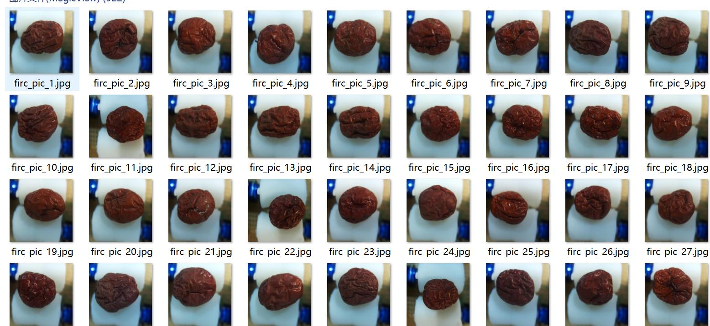
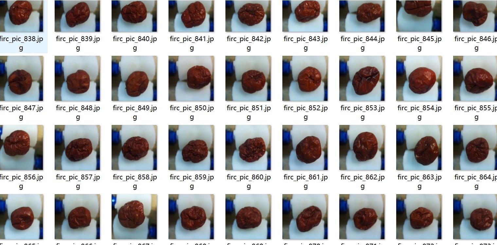
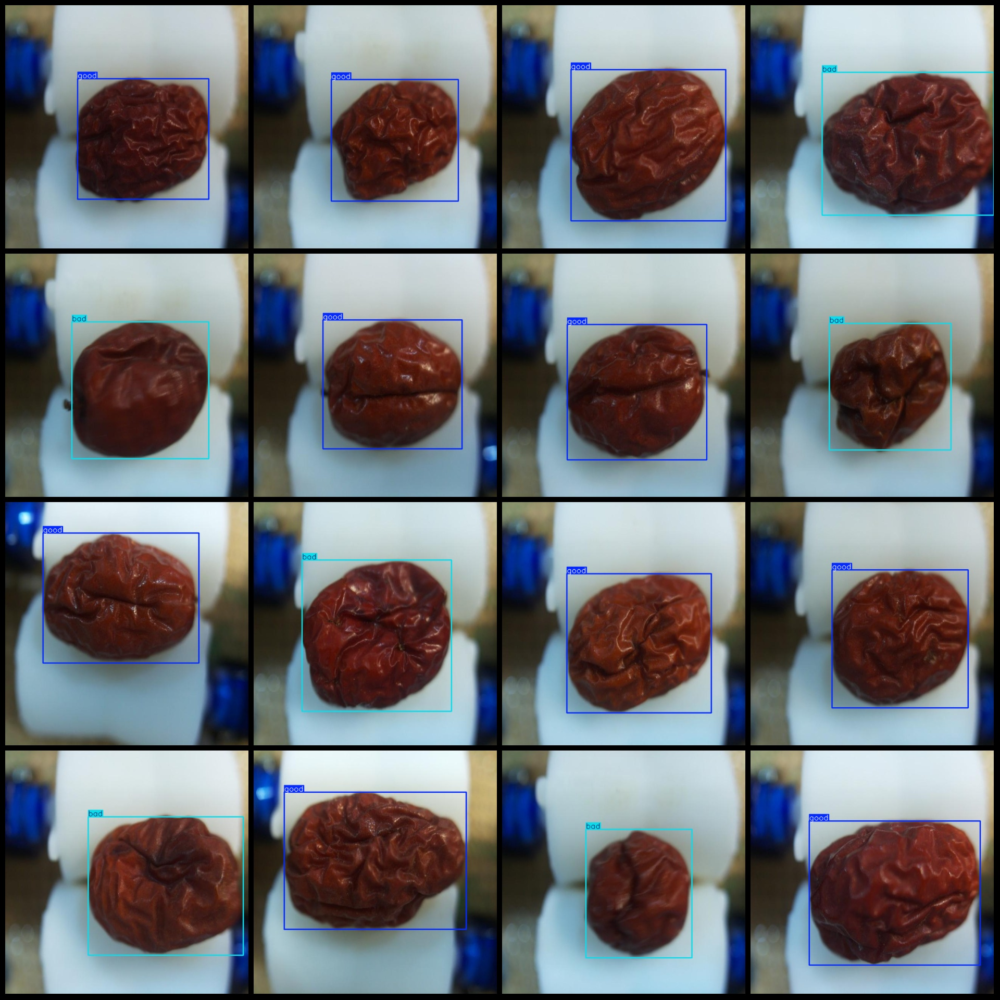
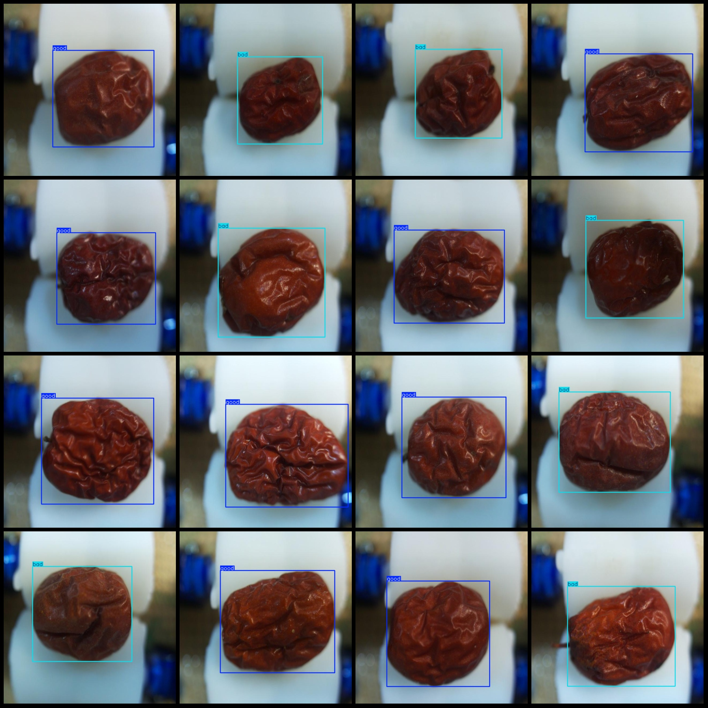

# Big Date Quality Classification Detection DataSet VOC+YOLO Format 922 Categories

Dataset format: Pascal VOC format+YOLO format (without split path txt file, only contain jpg image and corresponding VOC format xml file and yolo format txt file)
number of images: 922  
annotation count: 922  
annotation count: 922  
annotationnumber of classes: 2  
Annotation class names: ["bad", "good"]
boxes per class:   
bad box count = 418  
good box count = 504  
total boxes: 922  
images per class:   
bad images = 418  
good images = 504  
image resolution: 640x640  
Using the annotation tool: labelImg.
Annotation rules: Draw a rectangle around the class.
Important notes: The dataset needs to be divided into training, validation, and test sets.
Special statement: This dataset does not guarantee the accuracy of the trained model or the weight files.
Image preview:
## Images

Here is a pay link on Stripe ( https://buy.stripe.com/3cs8yP7sY87d0vu9AB ). Please contact me lonlonago@foxmail.com after funding $89, and I will send you a complete data files , thank you!

